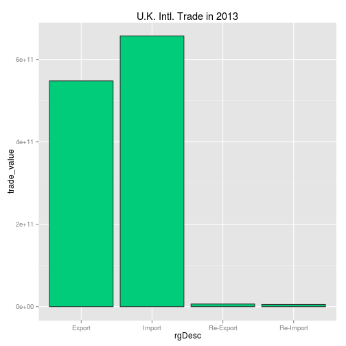

This is an R Markdown document. Markdown is a simple formatting syntax for authoring HTML, PDF, and MS Word documents. For more details on using R Markdown see <http://rmarkdown.rstudio.com>.

This document serves as an example of using the U.N. Comtrade API to collect data on imports and exports for countries over time. 

### Load dependent libraries


```r
library(RCurl)
library(dplyr)
library(jsonlite)
library(ggplot2)
library(ggvis)
```

## Data Collection

Full API Documentation available at http://comtrade.un.org/data/Doc/api/ex/r

```r
test_api_call <- "http://comtrade.un.org/api/get?max=50000&type=C&freq=A&px=HS&ps=2013&r=826&p=0&rg=all&cc=AG2&fmt=json"
un_data <- getURL(test_api_call)
un_data <- fromJSON(un_data)
un_data <- data.frame(un_data$dataset)
head(un_data)
```

```
##   pfCode   yr period periodDesc aggrLevel IsLeaf rgCode    rgDesc rtCode
## 1     H4 2013   2013       2013         2      0      1    Import    826
## 2     H4 2013   2013       2013         2      0      2    Export    826
## 3     H4 2013   2013       2013         2      0      3 Re-Export    826
## 4     H4 2013   2013       2013         2      0      4 Re-Import    826
## 5     H4 2013   2013       2013         2      0      1    Import    826
## 6     H4 2013   2013       2013         2      0      2    Export    826
##          rtTitle rt3ISO ptCode ptTitle pt3ISO ptCode2 ptTitle2 pt3ISO2
## 1 United Kingdom    GBR      0   World    WLD      NA                 
## 2 United Kingdom    GBR      0   World    WLD      NA                 
## 3 United Kingdom    GBR      0   World    WLD      NA                 
## 4 United Kingdom    GBR      0   World    WLD      NA                 
## 5 United Kingdom    GBR      0   World    WLD      NA                 
## 6 United Kingdom    GBR      0   World    WLD      NA                 
##   cstCode cstDesc motCode motDesc cmdCode                   cmdDescE
## 1                                      01               Live animals
## 2                                      01               Live animals
## 3                                      01               Live animals
## 4                                      01               Live animals
## 5                                      02 Meat and edible meat offal
## 6                                      02 Meat and edible meat offal
##   qtCode      qtDesc qtAltCode qtAltDesc TradeQuantity AltQuantity
## 1      1 No Quantity        NA                      NA          NA
## 2      1 No Quantity        NA                      NA          NA
## 3      1 No Quantity        NA                      NA          NA
## 4      1 No Quantity        NA                      NA          NA
## 5      1 No Quantity        NA                      NA          NA
## 6      1 No Quantity        NA                      NA          NA
##   NetWeight GrossWeight TradeValue CIFValue FOBValue estCode
## 1        NA          NA  638496202       NA       NA       0
## 2        NA          NA  618257677       NA       NA       0
## 3        NA          NA       1415       NA       NA       0
## 4        NA          NA    1814512       NA       NA       0
## 5        NA          NA 6095731992       NA       NA       0
## 6        NA          NA 2290053167       NA       NA       0
```

## Data Processing

Reference Tables for the Comtrade Database available at
http://unstats.un.org/unsd/tradekb/Knowledgebase/UN-Comtrade-Reference-Tables


```
## [1] "TODO"
```

## Data Analysis

What are the basic net trade statistics for the U.K. in 2013?


```r
net_trade <- un_data %>% 
    group_by(rgDesc) %>%
    summarise(trade_value = sum(TradeValue))
    
ggplot(data = net_trade, aes(x = rgDesc, y = trade_value)) + 
    geom_bar(stat = "identity", fill = "#00cc7a", color = '#333333') + 
    ggtitle("U.K. Intl. Trade in 2013")
```

 

What were the net trade statistics by category?


```r
net_categories <- un_data %>% 
    mutate(trade_type = rgDesc, 
           trade_category = cmdDescE) %>%
    group_by(trade_type, trade_category) %>%
    summarise(trade_value = sum(TradeValue)) %>%
    filter(trade_value > mean(trade_value))
    
net_categories$trade_category_abbr <- gsub(" and | or | of | the ", 
                                           " ",
                                           net_categories$trade_category)

net_categories$trade_category_abbr <- gsub(";.*$", 
                                           "",
                                           net_categories$trade_category)

net_categories$trade_category_abbr <- substr(net_categories$trade_category_abbr, 1, 32)

net_categories %>% 
    ggvis(y = ~factor(trade_category_abbr), fill = ~factor(trade_type)) %>%
    compute_stack(stack_var = ~trade_value, group_var = ~trade_category_abbr) %>%
    layer_rects(x = ~stack_lwr_, x2 = ~stack_upr_, height = band()) %>%
    add_axis("x", properties = axis_props(
    grid = list(stroke = "gray"),
    ticks = list(stroke = "blue", strokeWidth = 2),
    labels = list(angle = 45, align = "left", fontSize = 12))) %>%
    add_axis("y", title_offset = 225)
```

```
## Warning in rbind_all(out[[1]]): Unequal factor levels: coercing to
## character
```

```
## Warning in rbind_all(out[[1]]): Unequal factor levels: coercing to
## character
```

<!--html_preserve--><div id="plot_id403064129-container" class="ggvis-output-container">
<div id="plot_id403064129" class="ggvis-output"></div>
<div class="plot-gear-icon">
<nav class="ggvis-control">
<a class="ggvis-dropdown-toggle" title="Controls" onclick="return false;"></a>
<ul class="ggvis-dropdown">
<li>
Renderer: 
<a id="plot_id403064129_renderer_svg" class="ggvis-renderer-button" onclick="return false;" data-plot-id="plot_id403064129" data-renderer="svg">SVG</a>
 | 
<a id="plot_id403064129_renderer_canvas" class="ggvis-renderer-button" onclick="return false;" data-plot-id="plot_id403064129" data-renderer="canvas">Canvas</a>
</li>
<li>
<a id="plot_id403064129_download" class="ggvis-download" data-plot-id="plot_id403064129">Download</a>
</li>
</ul>
</nav>
</div>
</div>
<script type="text/javascript">
var plot_id403064129_spec = {
  "data": [
    {
      "name": ".0/stack1_flat",
      "format": {
        "type": "csv",
        "parse": {
          "stack_lwr_": "number",
          "stack_upr_": "number"
        }
      },
      "values": "\"trade_type\",\"factor(trade_category_abbr)\",\"factor(trade_type)\",\"stack_lwr_\",\"stack_upr_\"\n\"Export\",\"Aircraft, spacecraft, and parts \",\"Export\",0,17851668045\n\"Export\",\"Articles of iron or steel\",\"Export\",0,6528900158\n\"Export\",\"Beverages, spirits and vinegar\",\"Export\",0,10985422204\n\"Export\",\"Electrical machinery and equipme\",\"Export\",0,30928795455\n\"Export\",\"Essential oils and resinoids\",\"Export\",0,6129797947\n\"Export\",\"Iron and steel\",\"Export\",0,10133063072\n\"Export\",\"Mineral fuels, mineral oils and \",\"Export\",0,62365065840\n\"Export\",\"Miscellaneous chemical products\",\"Export\",0,7420987940\n\"Export\",\"Natural or cultured pearls, prec\",\"Export\",0,99889281704\n\"Export\",\"Nuclear reactors, boilers, machi\",\"Export\",0,70532996908\n\"Export\",\"Optical, photographic, cinematog\",\"Export\",0,18569926743\n\"Export\",\"Organic chemicals\",\"Export\",0,12765620344\n\"Export\",\"Pharmaceutical products\",\"Export\",0,32094368469\n\"Export\",\"Plastics and articles thereof\",\"Export\",0,12088982822\n\"Export\",\"Vehicles other than railway or t\",\"Export\",0,50994805705\n\"Export\",\"Works of art, collectors' pieces\",\"Export\",0,6901778238\n\"Import\",\"Aircraft, spacecraft, and parts \",\"Import\",17851668045,33018334739\n\"Import\",\"Articles of apparel and clothing\",\"Import\",0,12830510385\n\"Import\",\"Articles of apparel and clothing\",\"Import\",12830510385,25023403641\n\"Import\",\"Articles of iron or steel\",\"Import\",6528900158,15635565509\n\"Import\",\"Beverages, spirits and vinegar\",\"Import\",10985422204,19956368359\n\"Import\",\"Electrical machinery and equipme\",\"Import\",30928795455,89705967894\n\"Import\",\"Furniture\",\"Import\",0,9873893030\n\"Import\",\"Mineral fuels, mineral oils and \",\"Import\",62365065840,150558785208\n\"Import\",\"Natural or cultured pearls, prec\",\"Import\",99889281704,136721815009\n\"Import\",\"Nuclear reactors, boilers, machi\",\"Import\",70532996908,149820085874\n\"Import\",\"Optical, photographic, cinematog\",\"Import\",18569926743,36354533664\n\"Import\",\"Organic chemicals\",\"Import\",12765620344,25777015071\n\"Import\",\"Paper and paperboard\",\"Import\",0,8737462440\n\"Import\",\"Pharmaceutical products\",\"Import\",32094368469,59822866380\n\"Import\",\"Plastics and articles thereof\",\"Import\",12088982822,30941508712\n\"Import\",\"Vehicles other than railway or t\",\"Import\",50994805705,117126127872\n\"Re-Export\",\"Aircraft, spacecraft, and parts \",\"Re-Export\",33018334739,33258619213\n\"Re-Export\",\"Articles of apparel and clothing\",\"Re-Export\",25023403641,25167890474\n\"Re-Export\",\"Articles of apparel and clothing\",\"Re-Export\",25167890474,25472738565\n\"Re-Export\",\"Electrical machinery and equipme\",\"Re-Export\",89705967894,89856118869\n\"Re-Export\",\"Footwear, gaiters and the like\",\"Re-Export\",0,88729279\n\"Re-Export\",\"Mineral fuels, mineral oils and \",\"Re-Export\",150558785208,150703251325\n\"Re-Export\",\"Natural or cultured pearls, prec\",\"Re-Export\",136721815009,138230985991\n\"Re-Export\",\"Nuclear reactors, boilers, machi\",\"Re-Export\",149820085874,150049534100\n\"Re-Export\",\"Vehicles other than railway or t\",\"Re-Export\",117126127872,118685832017\n\"Re-Export\",\"Works of art, collectors' pieces\",\"Re-Export\",6901778238,8619023062\n\"Re-Import\",\"Aircraft, spacecraft, and parts \",\"Re-Import\",33258619213,33677657976\n\"Re-Import\",\"Articles of apparel and clothing\",\"Re-Import\",25472738565,25554790685\n\"Re-Import\",\"Electrical machinery and equipme\",\"Re-Import\",89856118869,90297543450\n\"Re-Import\",\"Natural or cultured pearls, prec\",\"Re-Import\",138230985991,138564596701\n\"Re-Import\",\"Nuclear reactors, boilers, machi\",\"Re-Import\",150049534100,152594275885\n\"Re-Import\",\"Optical, photographic, cinematog\",\"Re-Import\",36354533664,37034279835\n\"Re-Import\",\"Pharmaceutical products\",\"Re-Import\",59822866380,59948953606\n\"Re-Import\",\"Ships, boats and floating struct\",\"Re-Import\",0,77728039\n\"Re-Import\",\"Vehicles other than railway or t\",\"Re-Import\",118685832017,118760813666\n\"Re-Import\",\"Works of art, collectors' pieces\",\"Re-Import\",8619023062,9002159071"
    },
    {
      "name": ".0/stack1",
      "source": ".0/stack1_flat",
      "transform": [
        {
          "type": "treefacet",
          "keys": [
            "data.trade_type"
          ]
        }
      ]
    },
    {
      "name": "scale/fill",
      "format": {
        "type": "csv",
        "parse": {}
      },
      "values": "\"domain\"\n\"Export\"\n\"Import\"\n\"Re-Export\"\n\"Re-Import\""
    },
    {
      "name": "scale/x",
      "format": {
        "type": "csv",
        "parse": {
          "domain": "number"
        }
      },
      "values": "\"domain\"\n-7629713794.25\n160223989679.25"
    },
    {
      "name": "scale/y",
      "format": {
        "type": "csv",
        "parse": {}
      },
      "values": "\"domain\"\n\"Aircraft, spacecraft, and parts \"\n\"Articles of apparel and clothing\"\n\"Articles of iron or steel\"\n\"Beverages, spirits and vinegar\"\n\"Electrical machinery and equipme\"\n\"Essential oils and resinoids\"\n\"Footwear, gaiters and the like\"\n\"Furniture\"\n\"Iron and steel\"\n\"Mineral fuels, mineral oils and \"\n\"Miscellaneous chemical products\"\n\"Natural or cultured pearls, prec\"\n\"Nuclear reactors, boilers, machi\"\n\"Optical, photographic, cinematog\"\n\"Organic chemicals\"\n\"Paper and paperboard\"\n\"Pharmaceutical products\"\n\"Plastics and articles thereof\"\n\"Ships, boats and floating struct\"\n\"Vehicles other than railway or t\"\n\"Works of art, collectors' pieces\""
    }
  ],
  "scales": [
    {
      "name": "fill",
      "type": "ordinal",
      "domain": {
        "data": "scale/fill",
        "field": "data.domain"
      },
      "points": true,
      "sort": false,
      "range": "category10"
    },
    {
      "name": "x",
      "domain": {
        "data": "scale/x",
        "field": "data.domain"
      },
      "zero": false,
      "nice": false,
      "clamp": false,
      "range": "width"
    },
    {
      "type": "ordinal",
      "domain": {
        "data": "scale/y",
        "field": "data.domain"
      },
      "name": "y",
      "points": false,
      "sort": false,
      "range": "height",
      "padding": 0.1
    }
  ],
  "marks": [
    {
      "type": "group",
      "from": {
        "data": ".0/stack1"
      },
      "marks": [
        {
          "type": "rect",
          "properties": {
            "update": {
              "stroke": {
                "value": "#000000"
              },
              "y": {
                "scale": "y",
                "field": "data.factor(trade_category_abbr)"
              },
              "fill": {
                "scale": "fill",
                "field": "data.factor(trade_type)"
              },
              "x": {
                "scale": "x",
                "field": "data.stack_lwr_"
              },
              "x2": {
                "scale": "x",
                "field": "data.stack_upr_"
              },
              "height": {
                "scale": "y",
                "band": true
              }
            },
            "ggvis": {
              "data": {
                "value": ".0/stack1"
              }
            }
          }
        }
      ]
    }
  ],
  "legends": [
    {
      "orient": "right",
      "fill": "fill",
      "title": "factor(trade_type)"
    }
  ],
  "axes": [
    {
      "type": "x",
      "scale": "x",
      "orient": "bottom",
      "layer": "back",
      "grid": true,
      "properties": {
        "ticks": {
          "stroke": {
            "value": "blue"
          },
          "strokeWidth": {
            "value": 2
          }
        },
        "grid": {
          "stroke": {
            "value": "gray"
          }
        },
        "labels": {
          "angle": {
            "value": 45
          },
          "align": {
            "value": "left"
          },
          "fontSize": {
            "value": 12
          }
        }
      }
    },
    {
      "type": "y",
      "scale": "y",
      "orient": "left",
      "titleOffset": 225,
      "layer": "back",
      "grid": true,
      "title": "factor(trade_category_abbr)"
    }
  ],
  "padding": null,
  "ggvis_opts": {
    "keep_aspect": false,
    "resizable": true,
    "padding": {},
    "duration": 250,
    "renderer": "svg",
    "hover_duration": 0,
    "width": 504,
    "height": 504
  },
  "handlers": null
};
ggvis.getPlot("plot_id403064129").parseSpec(plot_id403064129_spec);
</script><!--/html_preserve-->

